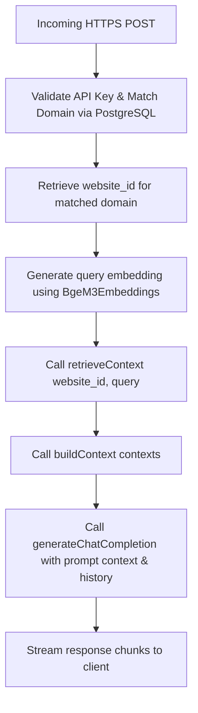

# Chatbot API Integration Contract

This document describes the interface and data flow for the future Chatbot RAG endpoints.

---

## 1. Chat Completion Endpoint

**Endpoint:** `POST https://api.spplabs.es/chat` (handled via Next.js API/Route Handlers matching the domain mapping configuration)

### Request Payload (JSON)
```json
{
  "domain": "customer-website.com",
  "message": "What are your business hours?",
  "history": [
    ["human", "Hello"],
    ["assistant", "Hi, how can I help you today?"]
  ]
}
```

### Request Headers
```http
x-api-key: spp_api_xxxxxxxxxxxxxxxx
Content-Type: application/json
```

---

## 2. Server-Side Execution Pipeline

Every chatbot completion request follows this sequential pipeline:



### Key Orchestration Components

1.  **Authorization:**
    Reuse existing domain and key hashes validation from `crypto.ts` and `Prisma` database queries (standard architecture).
2.  **Context Retrieval (`rag.ts`):**
    ```typescript
    const rawContexts = await retrieveContext(websiteId, message);
    const context = buildContext(rawContexts);
    ```
3.  **Prompt Composition (`prompts.ts`):**
    Format prompt templates using system instructions and formatted chat history:
    ```typescript
    const prompt = await ragPromptTemplate.formatMessages({
      context,
      history,
      question: message
    });
    ```
4.  **vLLM Inference (`llm.ts`):**
    Generate completions (streaming response) forcing non-reasoning mode:
    ```typescript
    const stream = await generateChatCompletion({
      messages: prompt,
      stream: true,
      temperature: 0.2
    });
    ```
